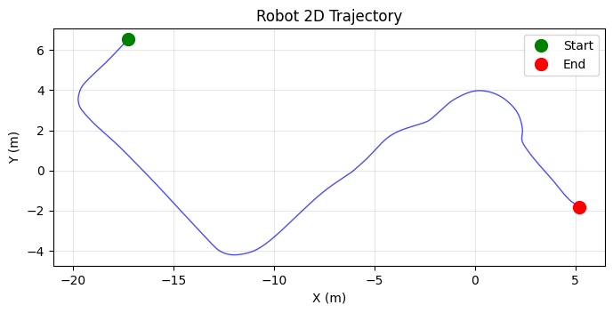
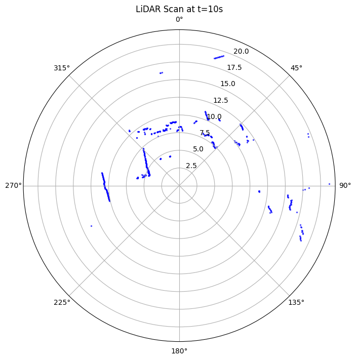
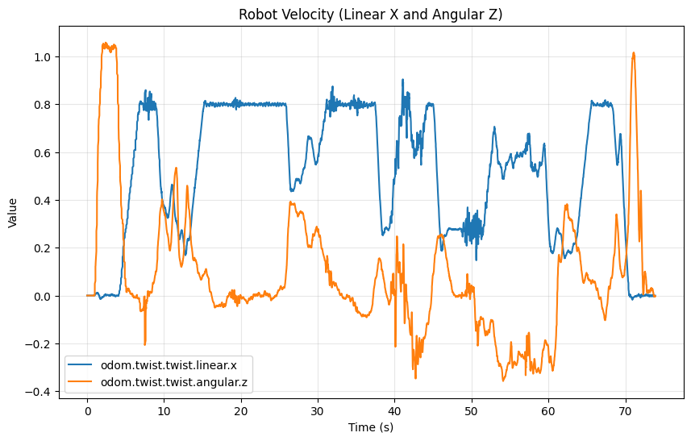

# ROSBag MCP Server

The code is inspired by [ROSBag MCP Server: Analyzing Robot Data with LLMs for Agentic Embodied AI Applications](https://arxiv.org/pdf/2511.03497).

An MCP (Model Context Protocol) server for analyzing ROS and ROS 2 bag files with LLMs. Enables natural language interaction with robotic datasets for debugging, performance evaluation, and extracting insights.

## Features

### Core Data Access & Management
| Tool | Description |
|------|-------------|
| `set_bag_path` | Set path to a rosbag file or directory |
| `list_bags` | List all available rosbag files in directory |
| `bag_info` | Retrieve bag metadata: topics, message counts, duration, time range |
| `get_topic_schema` | Inspect message structure/schema with sample data |

### Message Retrieval
| Tool | Description |
|------|-------------|
| `get_message_at_time` | Get message from a topic at a specific timestamp |
| `get_messages_in_range` | Get all messages from a topic within a time range |
| `search_messages` | Search messages using conditions (regex, equals, near_position, threshold) |

### Data Filtering & Export
| Tool | Description |
|------|-------------|
| `filter_bag` | Create a filtered copy of a bag file by topic, time, or sample rate |
| `export_to_csv` | Export topic data to CSV file for external analysis |

### Domain-Specific Analysis
| Tool | Description |
|------|-------------|
| `analyze_trajectory` | Compute trajectory metrics: total distance, mean/max speeds, position bounds |
| `analyze_lidar_scan` | Analyze LiDAR scans for obstacles, gaps, and statistics |
| `analyze_imu` | Analyze IMU data: acceleration, angular velocity, orientation statistics |
| `analyze_logs` | Parse and analyze ROS logs; filter by level or node |
| `get_tf_tree` | Get TF tree of coordinate frame relationships |
| `get_image_at_time` | Extract camera image at specific time (returns base64 JPEG) |

### Navigation Analysis
| Tool | Description |
|------|-------------|
| `analyze_path_tracking` | Compute cross-track error between planned path and actual pose (AMCL/odom) |
| `analyze_costmap_violations` | Check if robot entered obstacle/lethal cells in costmap |
| `analyze_navigation_health` | Aggregate navigation errors, recovery events, and goal outcomes for health assessment |
| `analyze_wheel_slip` | Compare commanded vs actual velocity to detect traction loss and wheel slip |

### Statistics & Event Detection
| Tool | Description |
|------|-------------|
| `analyze_topic_stats` | Analyze topic frequency, latency, message intervals, and gaps |
| `compare_topics` | Compare two topic fields: correlation, difference, RMSE |
| `detect_events` | Detect threshold crossings, below-threshold, sudden changes, anomalies, stoppages |
| `analyze_lidar_timeseries` | Track LiDAR statistics over time: min distance, obstacle count, closest approach |

### Visualization & Plotting
| Tool | Description |
|------|-------------|
| `plot_timeseries` | Plot time series data with multiple fields/styles |
| `plot_2d` | Create 2D trajectory plots (XY positions) |
| `plot_lidar_scan` | Visualize LiDAR scans as polar plots |
| `plot_comparison` | Overlay plot of two topic fields with difference highlighting |

## Supported Formats

| Format | Extension | Description |
|--------|-----------|-------------|
| ROS 1 | `.bag` | Standard ROS 1 bag format |
| ROS 2 | `.db3` | SQLite-based ROS 2 format |
| ROS 2 | `.mcap` | Modern container format by Foxglove |

## Installation

### From PyPI

```bash
# Using uv (recommended)
uv pip install rosbag-mcp

# Using pip
pip install rosbag-mcp
```

### From GitHub

```bash
# Using uv
uv pip install "rosbag-mcp @ git+https://github.com/cjh1995-ros/rosbag-mcp.git"

# Using pip
pip install "rosbag-mcp @ git+https://github.com/cjh1995-ros/rosbag-mcp.git"
```

### From Source (development)

```bash
git clone https://github.com/cjh1995-ros/rosbag-mcp.git
cd rosbag-mcp
uv pip install -e ".[dev]"
```

### Requirements

- Python >= 3.10
- [mcp](https://github.com/anthropics/mcp) >= 1.0.0
- [rosbags](https://github.com/rpng/rosbags) >= 0.9.0
- numpy, matplotlib, Pillow

## Usage

### Claude Desktop / Claude Code

Add to `~/Library/Application Support/Claude/claude_desktop_config.json` (macOS) or `%APPDATA%\Claude\claude_desktop_config.json` (Windows):

```json
{
  "mcpServers": {
    "rosbag": {
      "command": "rosbag-mcp"
    }
  }
}
```

Or run with `uvx` without installing:

```json
{
  "mcpServers": {
    "rosbag": {
      "command": "uvx",
      "args": ["rosbag-mcp"]
    }
  }
}
```

### As MCP Server (stdio)

```bash
rosbag-mcp
```

### Programmatic Usage (Python)

```python
import asyncio
from mcp import ClientSession, StdioServerParameters
from mcp.client.stdio import stdio_client

async def analyze_bag():
    server_params = StdioServerParameters(
        command="python",
        args=["-m", "rosbag_mcp.server"],
    )
    
    async with stdio_client(server_params) as (read, write):
        async with ClientSession(read, write) as session:
            await session.initialize()
            
            # Set bag path
            await session.call_tool("set_bag_path", {
                "path": "/path/to/your/bag.bag"
            })
            
            # Get bag info
            result = await session.call_tool("bag_info", {})
            print(result.content[0].text)
            
            # Analyze trajectory
            result = await session.call_tool("analyze_trajectory", {
                "pose_topic": "/odom"
            })
            print(result.content[0].text)

asyncio.run(analyze_bag())
```

## Example Queries

Once connected to Claude or another LLM with MCP support:

```
"What bags do you have in /path/to/rosbags?"

"Show me the bag info for test.bag"

"What's the message structure of /odom topic?"

"Plot the robot's trajectory from the /odom topic"

"What was the robot's maximum velocity between t=10s and t=30s?"

"Has the robot ever passed close to position (x=2, y=-2) within 0.5 meters?"

"Analyze the LiDAR scan at t=15s - are there any obstacles within 2 meters?"

"Plot the commanded vs actual velocities for the first 30 seconds"

"Show me the TF tree - what are all the coordinate frames?"

"Filter the bag to only include /odom and /cmd_vel topics"

"Analyze the IMU data - what's the average acceleration?"

"Did the robot ever hit the costmap during navigation?"

"How well did the robot follow the planned path? What was the cross-track error?"

"Compare the commanded velocity vs actual velocity - what's the correlation?"

"When did the robot stop moving? Detect all stoppages."

"What's the publishing frequency of /odom? Are there any gaps?"

"Export the odometry data to CSV for analysis in Python"

"Is the robot experiencing wheel slip? Compare commanded vs actual velocity."

"Give me a navigation health report - any errors, recoveries, or planning failures?"

"Track the LiDAR minimum distance over time - when was the closest approach?"

"Plot a comparison of commanded velocity vs actual velocity with the difference."

"Detect all events where velocity dropped below -0.05 m/s (backward motion)."
```

## Example Output

### Bag Info
```json
{
  "path": "/data/robot_nav.bag",
  "duration": 73.97,
  "start_time": 1769892473.39,
  "end_time": 1769892547.36,
  "message_count": 191336,
  "topics": [
    {"name": "/odom", "type": "nav_msgs/msg/Odometry", "count": 4429},
    {"name": "/scan", "type": "sensor_msgs/msg/LaserScan", "count": 1108},
    {"name": "/tf", "type": "tf2_msgs/msg/TFMessage", "count": 27955}
  ]
}
```

### Trajectory Analysis
```json
{
  "total_distance_m": 38.26,
  "duration_s": 73.87,
  "x_range": {"min": -19.75, "max": 5.21},
  "y_range": {"min": -4.20, "max": 6.53},
  "linear_speed": {"mean": 0.518, "max": 0.905, "min": 0.0},
  "angular_speed": {"mean": 0.178, "max": 1.058, "min": 0.0}
}
```

### LiDAR Analysis
```json
{
  "timestamp": 1769892483.52,
  "total_rays": 689,
  "valid_rays": 426,
  "statistics": {
    "min_distance": 4.12,
    "max_distance": 21.98,
    "mean_distance": 9.89
  },
  "obstacles": {
    "threshold_m": 2.0,
    "count": 0,
    "closest_distance": null
  }
}
```

### IMU Analysis
```json
{
  "topic": "/base_board/imu",
  "message_count": 7386,
  "duration_s": 73.88,
  "sample_rate_hz": 99.97,
  "linear_acceleration": {
    "x": {"mean": -0.0015, "std": 0.0205, "min": -0.2256, "max": 0.2467},
    "y": {"mean": -0.0018, "std": 0.0409, "min": -0.3311, "max": 0.4044},
    "z": {"mean": -0.0307, "std": 0.0916, "min": -0.9011, "max": 0.7922},
    "magnitude": {"mean": 0.0657, "max": 0.9559}
  },
  "angular_velocity": {
    "x": {"mean": 0.002, "std": 0.0459, "max_abs": 0.5867},
    "y": {"mean": 0.0001, "std": 0.0204, "max_abs": 0.2222},
    "z": {"mean": 0.0828, "std": 0.2694, "max_abs": 1.061}
  }
}
```

### Path Tracking Analysis
```json
{
  "path_topic": "/move_base/GlobalPlanner/plan",
  "pose_topic": "/amcl_pose",
  "tracking_samples": 641,
  "cross_track_error": {
    "mean_m": 0.0161,
    "std_m": 0.0125,
    "min_m": 0.0,
    "max_m": 0.0817,
    "median_m": 0.0132,
    "p95_m": 0.0377
  },
  "path_completion": {
    "final_progress": 1.0,
    "max_progress": 1.0
  }
}
```

### Topic Statistics
```json
{
  "topic": "/odom",
  "message_count": 4429,
  "duration_s": 73.873,
  "frequency": {
    "mean_hz": 59.94,
    "std_hz": 53116.3,
    "min_hz": 5.54,
    "max_hz": 419430.4
  },
  "interval": {
    "mean_ms": 16.683,
    "std_ms": 11.203,
    "min_ms": 0.002,
    "max_ms": 180.384
  },
  "gaps": {
    "count": 92,
    "threshold_ms": 50.049,
    "largest_gap_ms": 180.384
  }
}
```

### Costmap Violation Check
```json
{
  "costmap_topic": "/move_base/local_costmap/costmap",
  "pose_topic": "/amcl_pose",
  "cost_threshold": 253,
  "violations": {"count": 0, "samples": []},
  "cost_distribution": {"0-49": 626, "50-99": 15},
  "summary": "No costmap violations detected - Robot stayed in free space"
}
```

## Visualization Examples

### 2D Trajectory Plot


### LiDAR Scan (Polar Plot)


### Velocity Time Series


## Architecture

```
┌─────────────────┐     stdio      ┌──────────────────┐
│   MCP Client    │◄──────────────►│  ROSBag MCP      │
│  (Claude, etc)  │    JSON-RPC    │     Server       │
└─────────────────┘                └────────┬─────────┘
                                            │
                                            ▼
                                   ┌──────────────────┐
                                   │  rosbags library │
                                   │  (Python)        │
                                   └────────┬─────────┘
                                            │
                    ┌───────────────────────┼───────────────────────┐
                    ▼                       ▼                       ▼
              ┌──────────┐           ┌──────────┐           ┌──────────┐
              │  .bag    │           │  .mcap   │           │  .db3    │
              │ (ROS 1)  │           │ (ROS 2)  │           │ (ROS 2)  │
              └──────────┘           └──────────┘           └──────────┘
```

## Tool Schema Example

```json
{
  "name": "get_messages_in_range",
  "description": "Get all messages from a topic within a time range",
  "inputSchema": {
    "type": "object",
    "properties": {
      "topic": {
        "type": "string",
        "description": "ROS topic name"
      },
      "start_time": {
        "type": "number",
        "description": "Start unix timestamp in seconds"
      },
      "end_time": {
        "type": "number",
        "description": "End unix timestamp in seconds"
      },
      "max_messages": {
        "type": "integer",
        "description": "Maximum messages to return (default: 100)"
      },
      "bag_path": {
        "type": "string",
        "description": "Optional: specific bag file"
      }
    },
    "required": ["topic", "start_time", "end_time"]
  }
}
```

## References

- [Model Context Protocol (MCP)](https://modelcontextprotocol.io/)
- [rosbags - Pure Python ROS bag library](https://github.com/rpng/rosbags)
- [ROSBag MCP Paper](https://arxiv.org/abs/2511.03497)

## License

MIT License
